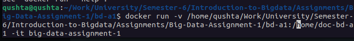
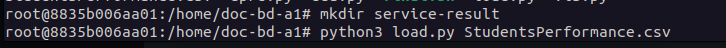
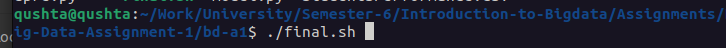

# Assignment-1-Big-Data

## Notes to run the image

1. run docker build -t {image_name} . ---> to build the docker image, run this command inside the git main repo when you clone it
2. docker run -it {image_name} ---> runs the container and opens a bash shell inside the container
3. (in the container shell) ---> make sure you're on the /home/doc-bd-a1 directory 
4. (ls) to check if the dataset is copied into the container directory
5. To make sure that the container is running, open another terminal and run docker ps

## Project Execution

1. Running the container using our working directory as a volume to use python files

2. making the reports folder and starting the execution pipeline inside the container

3. executing the shell script to copy the results to the local machine

## All docker commands used

* docker build --> to build the image from the Dockerfile

* docker cp 
    * to copy the dataset file to the image in the build phase
    * to copy the results from the container to the local machine in the execution phase (using the shell script)

* docker ps --> to show the our running container

* docker run -v --> to run the container using a volume on the local machine to use the python files

* docker stop {container_id} --> to stop the running container (used in the shell script to stop the running container after copying the result to the local machine)
